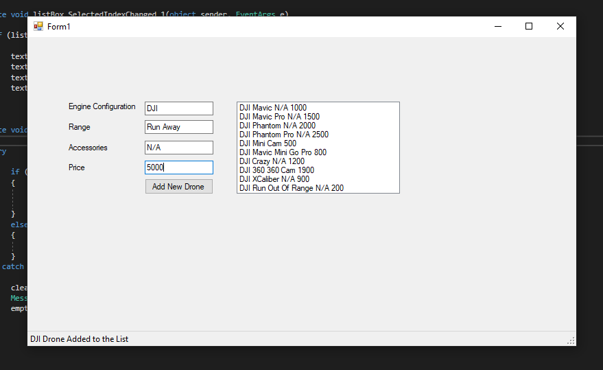
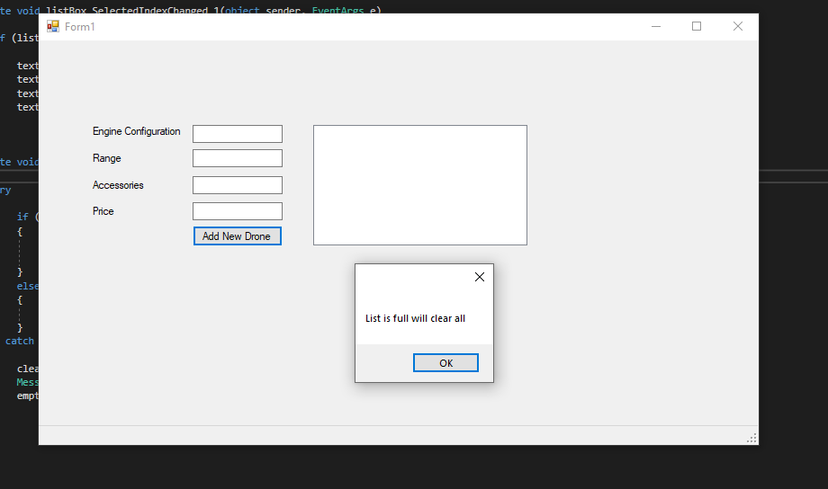

<!DOCTYPE html>
<html>
<head>
</head>
<body>

<h2>Arduino Temp Control App</h2>

This is probably the most exciting application I have ever done during my software course. 
I have coded Arduino Uno connected with my .NET form app wher I could control the arduino. 
I program fetches the data from Arduino to provide temperature and humidity in the air. 
 

    
    
    

</body>
</html>