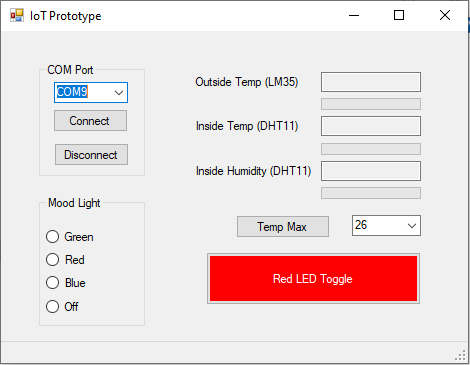

<!DOCTYPE html>
<html>
<head>
</head>
<body>

<h2>Arduino Temp Control App</h2>

This is probably the most exciting application I have ever done during my software course. 
I have coded Arduino Uno connected with my .NET form app wher I could control the arduino. 
I program fetches the data from Arduino to provide temperature and humidity in the air. 
I wish I could provide more pictures to see how it looks like but I got rid off my Arduino while ago. 
But if you have one feel free to test it and Please send me some pictures of it. 
 

    

</body>
</html>