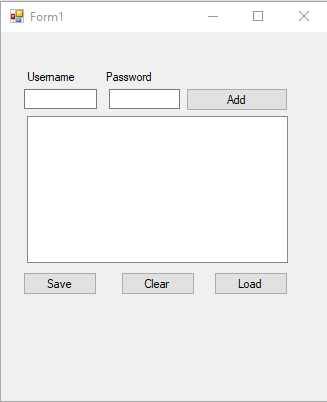
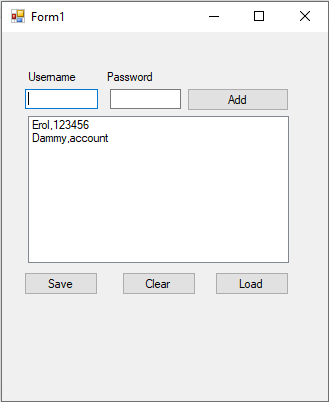
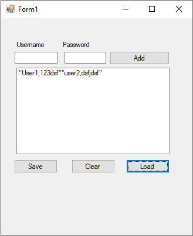

<!DOCTYPE html>
<html>
<head>
</head>
<body>

<h2>CVS Filer App</h2>

This program receives all account names and passwords. Saves it on to CVS file and able to load the file into 
the program. This program doesn't have much functionality as it made for learning purposes but this app has potential to 
convert this to database or real server if nessesary  
 

    
    
    

</body>
</html>