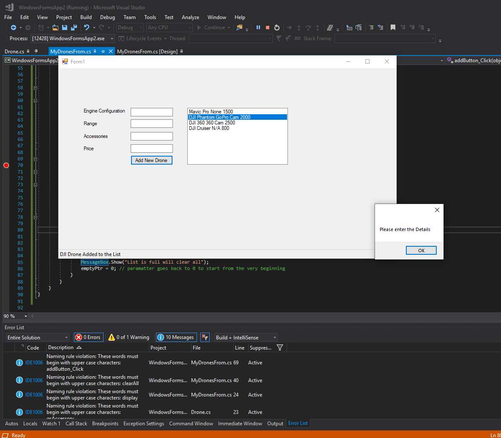
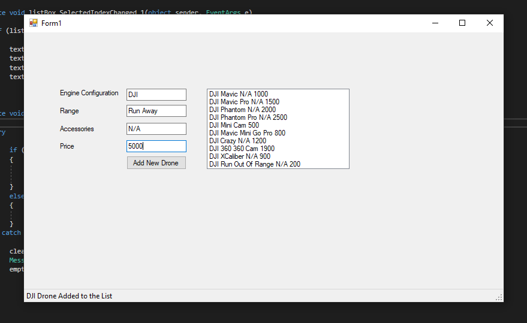
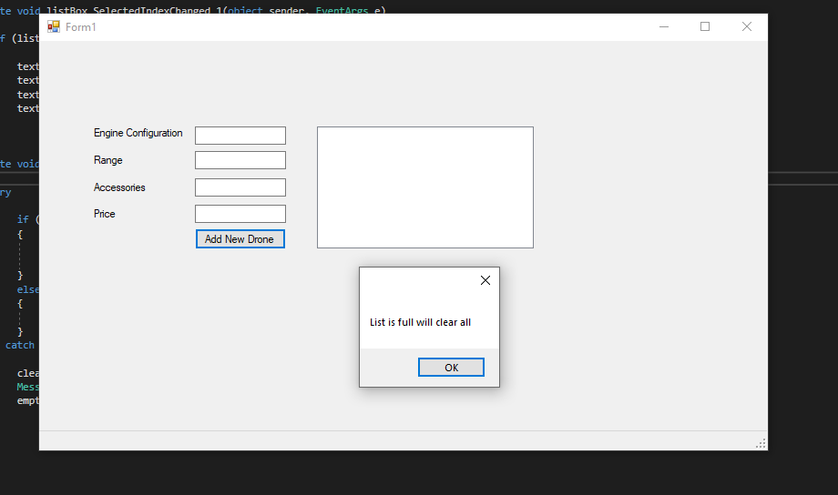

<!DOCTYPE html>
<html>
<head>
</head>
<body>

<h2>Drone Data App</h2>

This program just receives the details of the drone saves in the system. 
That's all :) if you expecting some thing fancier please visit Drone App or click <a href = "https://github.com/profiteroles/All-My-.Net-Application/tree/main/Drone-App">here</a>. 
 

    
    
    

</body>
</html>