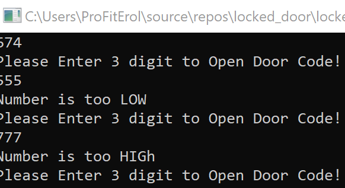

<!DOCTYPE html>
<html>
<head>
</head>
<body>

<h2>Guessing Password App</h2>

This is part of the learning curve where I had to implement n get police involce incase password guessed incorrectly so many times. 
 
 

    
    
    

</body>
</html>