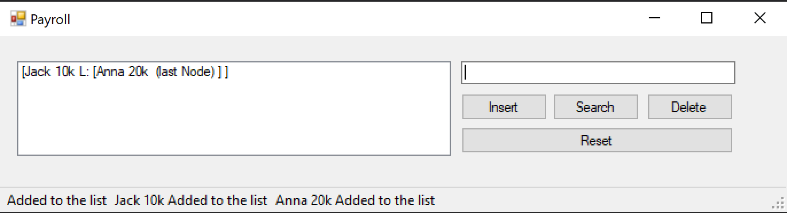

<!DOCTYPE html>
<html>
<head>
</head>
<body>

<h2>AVL Tree Payroll App</h2>

This program is more than just the payroll input accounting program 
It adds data with a sorting method so it is easy to search it when its nessesary. 
There is actually better version of this that I made with Flutter AVL Tree Visual <a href = "https://github.com/profiteroles/All-My-Flutter-Apps/tree/main/AVL-Balance-Tree">click here</a> to see it. 
 

    	
    	
    	
	
	
	

</body>
</html>