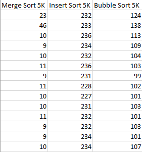
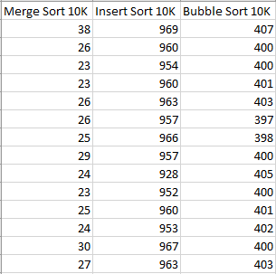
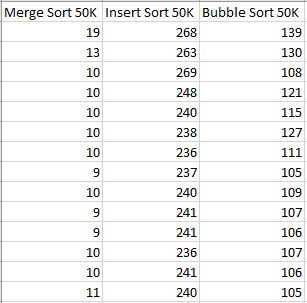

<!DOCTYPE html>
<html>
<head>
</head>
<body>

<h2>Sorting Algorithms App</h2>

Another useless task but tought me how to deal with algorithms and compare them 
This program designed to show how long does it take to sort algorithms and documents it 
on Excel file  
 

    
    
    
    

</body>
</html>