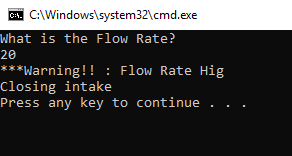
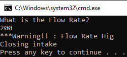
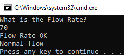

<!DOCTYPE html>
<html>
<head>
</head>
<body>

<h2>Water Flow Reader App</h2>

This program is such a simple console app where receives a data from user and sends and alert. 
It could be good one or a dangerous one it all depends on the input. 
 

    
    
    

</body>
</html>