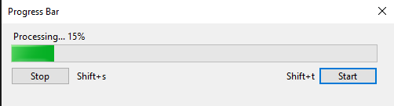
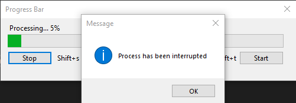
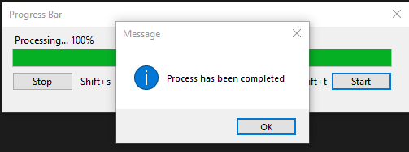

<!DOCTYPE html>
<html>
<head>
</head>
<body>

<h2>Interrup Key App</h2>

I still try to understand why I have given this hopeless task where I need to interrupt the the program to ruin it 
This poor program tries to accomlish a task but it gets interrupted by user 
 

    
    
    

</body>
</html>
